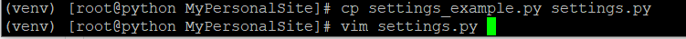
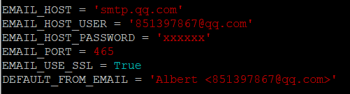
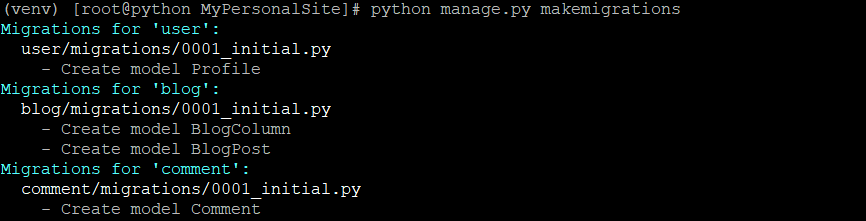
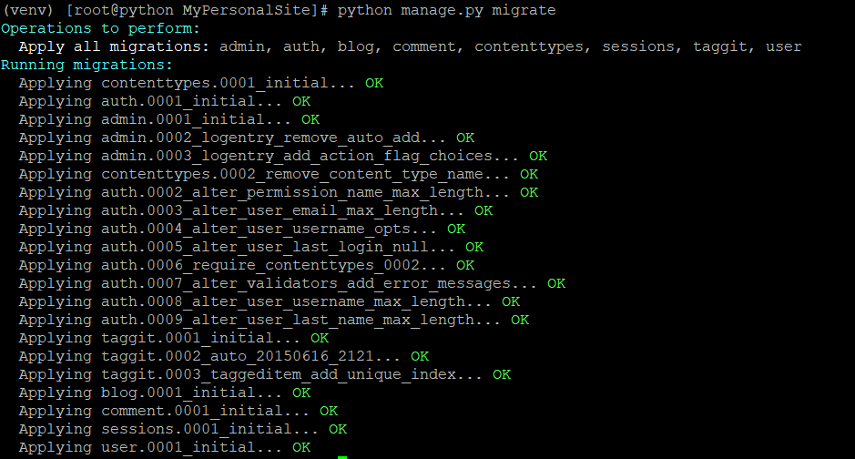
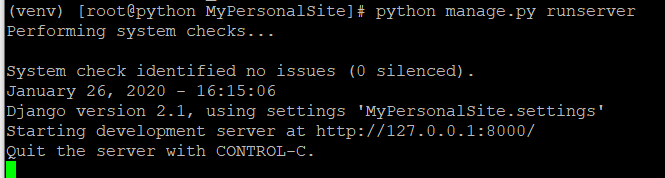
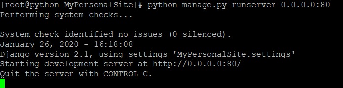
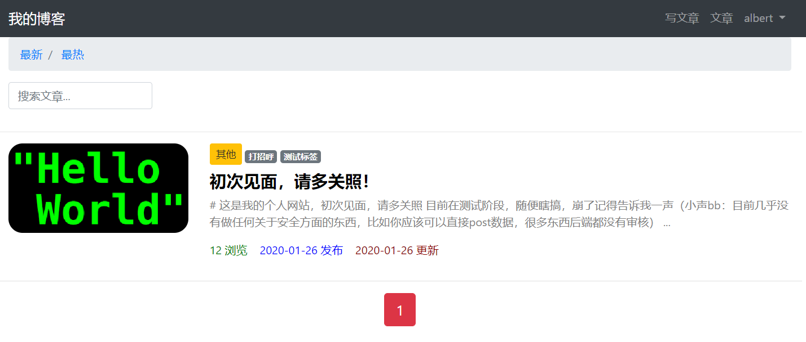

# MyPersonalSite

#### 简介

一个基于Python语言的个人网站源代码。后端使用Django实现。

#### 运行

- 运行语言：Python3（以下命令中python均默认为python3，若默认程序为python2，则需要手动指定python3）

- 依赖库

  - python库：Django，markdown，Pillow，django-ckeditor，django-mptt，django-password-reset，django-taggit

- 运行前准备

  - 将项目下的settings_example.py复制（或重命名）为settings.py，并编辑settings.py文件。

    
    
  - 修改邮箱设置，此邮箱将会作为密码重置等功能的发件邮箱。将settings.py的第165行，第166行，第169的值修改为自己的邮箱（分别为邮箱地址，邮箱密码，发件人），本项目采用QQ邮箱，SMTP协议发送邮件。若使用QQ邮箱，密码一栏填写QQ邮箱SMTP协议的授权码，若使用其他协议或其他邮箱，则还需要去官方网站上查询其使用的服务器地址及端口号。
  
    注：SMTP协议默认端口为25，QQ邮箱同时也支持使用465等端口，本地测试时可使用任选其一，但在阿里云服务器上配置时，若要使用SMTP服务，必须使用**SSL加密**的方式，此时不能再使用默认的25端口。
  
    
  
  - 进行数据迁移（建立数据库），进入manage.py文件所在目录，先后使用
  
    python manage.py makemigrations
  
    python manage.py migrate
  
    两条命令，当出现类似下图所示结果时，说明项目配置成功。
  
    
  
    
  
- 运行

  - 本机测试

    输入命令：python manage.py runserver

    出现如下结果，说明运行成功，可通过本地浏览器访问127.0.0.1:8000访问网站。

    

  - 服务器运行

    输入命令：python manage.py runserver 0.0.0.0:80

    出现如下结果，说明运行成功，可通过任意电脑访问。

    

    80端口为http协议默认端口，建议不要修改，若进行了修改，则用户访问时需要手动添加端口号，如xxx.xxx.xxx.xxx:8000。

- 其他事宜

  本项目在windows，linux下均可运行。

#### 样例

[http://39.107.80.178](http://39.107.80.178/)

本项目目前只实现了博客网站的常用功能，后续将逐渐添加其他功能，并提高安全性和界面美观程度。